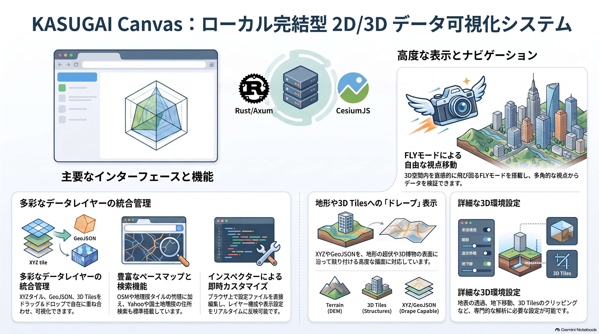

## 4. 実装システム

KASUGAI Canvas の現行実装は、ローカルPC 上で Rust/Axum サーバーを起動し、ブラウザ上の CesiumJS で 2D/3D 地理空間データを描画する構成です。Three.js は補助 3D 描画の枠組みとして組み込まれていますが、点群・3DGS・GLB 表示は V1.0.0 では未対応です。

開発起動時の初期インスペクターは空です。配布 ZIP と Windows インストーラーには東京都の表示例を含む `kasugai_canvas.config` が初期サンプルとして同梱されます。

- [Windows インストーラー ZIP — `kasugai_canvas_setup.zip`](https://github.com/yamamoto-ryuzo/kasugai_canvas/raw/main/download/kasugai_canvas_setup.zip)



## システム構成

```text
┌──────────────────────────────────────────────┐
│ ブラウザ                                      │
│                                              │
│  KASUGAI Layer & Tiles                        │
│  ├─ Layers / Tile / Camera / 設定 / Info / 凡例 │
│  ├─ インスペクター設定登録                     │
│  └─ レイヤー表示切替                           │
│                                              │
│  KASUGAI Basemap Selector                     │
│  └─ OSM / 地理院タイル / 航空写真              │
│                                              │
│  KASUGAI Navigation Toolbar                  │
│  ├─ 方位コンパス                              │
│  └─ 2Dトップダウン                             │
│                                              │
│  CesiumJS + Three.js                          │
│  - Viewer / Scene / Globe                     │
│  - ImageryLayerCollection                     │
│  - Cesium3DTileset                            │
│  - TerrainProvider                            │
└──────────────────────────────────────────────┘
                    ▲ HTTP
┌──────────────────────────────────────────────┐
│ Rust / Axum                                    │
│  127.0.0.1:8510                                │
│  index.html / cesium.js / styles.cssを配信     │
└──────────────────────────────────────────────┘
```

## 処理の流れ

1. Rust/Axum が `web` 配下の画面と設定 API を配信する
2. インスペクター設定からレイヤー、ベースマップ、カメラプリセットを生成する
3. CesiumJS が Terrain、XYZ、GeoJSON、3D Tiles を同一の 3D 地球ビューへ配置する
4. XYZ・GeoJSON を `ImageryLayer` / `Entity` / `Primitive` として地形へドレープする
5. Three.js は補助 3D 描画の枠組みとして組み込まれている。点群・3DGS・GLB 表示は V1.0.0 では未対応

## UI パネルと主な機能

| パネル | 主な機能 |
|---|---|
| **Layers & Tiles** | XYZ / GeoJSON / 3D Tiles レイヤーの追加・表示切替・削除、グループ・排他選択、ドラッグ＆ドロップ並び替え、設定への永続化 |
| **Basemap** | OSM / 地理院タイル / 航空写真等の切替、不透明度設定 |
| **Navigation** | Fly モード、2D トップダウン、方位コンパス、カメラプリセット |
| **Inspector** | `kasugai_canvas.config` の編集・登録 |
| **Info / 凡例** | 属性表示、凡例表示（属性内 URL はハイパーリンク対応） |
| **Search** | Yahoo 住所検索、国土地理院住所検索、Nominatim フォールバック |
| **Settings** | DEM / ドレープ、地下移動 / 地表透過 / 背景色、Cesium エフェクト、3D Tiles クリッピング、自動更新 |

その他、URL パーマリンク（latitude / longitude / zoom / pitch / bearing / project）の自動更新、共有 URL コピー、プロジェクト切替（`projects/<project>` 単位）、自動更新（`latest.json` 確認）も実装しています。

## レイヤーと描画順

| 種類 | 実装 | 表示方法 |
|------|------|----------|
| Terrain | Cesium `TerrainProvider` | 選択した DEM を `Globe` 地形として表示 |
| Base map | Cesium `ImageryLayer` | `Globe` 表面へ XYZ / TMS を貼り付け |
| XYZ | Cesium `ImageryLayer` | `ImageryLayerCollection` に追加。Terrain 上へ自動ドレープ |
| GeoJSON | Cesium `GeoJsonDataSource` / `Entity` / `Primitive` | 設定により追加。Terrain / 3D Tiles 表面へ高さ揃え |
| 3D Tiles | Cesium `Cesium3DTileset` | 設定により追加。Globe 上へ配置 |

レイヤーパネルの各行はドラッグ＆ドロップで並べ替えられます。並べ替えた順序は `ImageryLayerCollection` の `lower()` / `raise()` や `DataSource` の `index` へ反映されます。表示・非表示の切替や排他グループの動作は並べ替え後も維持されます。

## 地形、ドレープ、高さ基準

**DEM テクスチャー**は DEM から作った地形メッシュに Base map 画像を貼る表示です。**ドレープ**は XYZ・GeoJSON などのレイヤーを DEM または 3D Tiles の地形表面の起伏に沿わせて貼る表示です。前者は地形の下地画像、後者は既存レイヤーの地形追従であり、別の処理です。

CesiumJS では `ImageryLayer` は `Globe` 表面へ自動的に地形に沿って描画されるため、XYZ タイルは特別な `TerrainExtension` 不要でドレープされます。`GeoJsonDataSource` / `Entity` については `heightReference: Cesium.HeightReference.CLAMP_TO_GROUND` または `clampToGround: true` を指定して地形に吸着させます。

### ドレープの設定フロー

1. `DEM` で Terrain 表示に使う DEM / TerrainProvider を選ぶ
2. `ドレープ対象地形` の DEM／3D Tiles から、表示中で利用可能な地形を選ぶ
3. `ドレープを適用するレイヤー` で ON の XYZ・GeoJSON だけへ、選択した地形を適用する
4. Base map は標準では `ImageryLayer` として Globe 表面へ表示する

| 設定UI | 役割 | 他の設定への影響 |
|---|---|---|
| `DEM` | Terrain 表示に使う DEM を選ぶ | デフォルトは CesiumWorldTerrain または Re:Earth Terrain。DEM を追加する場合は TerrainProvider を実装して一覧へ登録する |
| `Terrain (DEM表示)` | 選択した `TerrainProvider` を有効にする | DEM をドレープ対象として使うには ON が必要。3D Tiles の表示・選択は変更しない |
| `3D Tiles (BASEMAPドレープ)` | Base map 専用の 3D Tiles ドレープを有効にする | 表示中の 3D Tiles がある場合、Base map の代わりに 3D Tiles 表面へテクスチャを重ねる。XYZ・GeoJSON の設定には影響しない |
| `ドレープ対象地形` | DEM と 3D Tiles を個別にドレープ面へ登録する | DEM・3D Tiles は初期状態で ON。両方を ON にすると、利用可能な両方をドレープ面にする |
| `ドレープを適用するレイヤー` | XYZ、GeoJSON の各レイヤーへ地形追従を付与する | XYZ・GeoJSON は初期状態で ON。ON のレイヤーだけをドレープする。地形ソース自体の表示は変更しない |

| ドレープ対象地形 | 有効になる条件 | ドレープ面 |
|---|---|---|
| DEM | `Terrain (DEM表示)` が ON | 表示中の DEM |
| 3D Tiles | URL を持つ 3D Tiles レイヤーが 1 つ以上表示中 | 表示中の 3D Tiles 表面 |
| DEM と 3D Tiles | 両方を ON にし、それぞれの有効条件を満たす | 条件を満たす DEM と 3D Tiles の両方 |
| どちらも OFF | なし | 適用レイヤーは通常表示 |

Terrain を ON にした場合、Base map は `ImageryLayer` として Globe 表面へ描画されます。`3D Tiles (BASEMAPドレープ)` を ON にすると、3D Tiles 表面へ別の `ImageryLayer` 相当のテクスチャを重ねます。Terrain を OFF にした場合も、表示中の 3D Tiles があれば Base map を 3D Tiles 表面へドレープし、それ以外は通常の `ImageryLayer` を表示します。

XYZ タイルはタイル提供元ごとの最大ズームまで取得します。OpenStreetMap は z19、地理院タイルは z18 を既定上限とし、設定の `maxZoom` で個別指定もできます。未知の提供元で 404 応答を受けた場合は、その一つ下を最終取得ズームとして再描画します。CesiumJS の `UrlTemplateImageryProvider` の `maximumLevel` / `tileDiscardPolicy` を使ってタイル欠損を制御します。

### 高さ基準

Terrain と 3D Tiles は、高さ基準を揃えなければ数十 m の上下ずれが生じます。データセットごとに高さ基準を確認して DEM / TerrainProvider を選択します。

| データ | 高さ基準 | 選択する DEM |
|---|---|---|
| 元の PLATEAU CityGML | 東京湾平均海面基準の標高（JGD2011 / EPSG:6697） | 標高基準の DEM / TerrainProvider を使用 |
| Re:Earth 配信の PLATEAU 3D Tiles | WGS84 楕円体からの高さ | `Re:Earth Terrain (楕円体高 / WGS84)` 対応 TerrainProvider |
| WGS84 楕円体高で作成されたその他の 3D Tiles・Cesium 地形 | WGS84 楕円体からの高さ | `Re:Earth Terrain (楕円体高 / WGS84)` 対応 TerrainProvider |
| 高さ基準が不明な 3D Tiles | データ仕様または tileset のメタデータを確認する | 確認後に上記いずれかを選ぶ |

Re:Earth Terrain は Terrarium 形式の 512×512 ピクセル・24bit RGB PNG で配信され、`height = R × 256 + G + B / 256 - 32768` でメートル単位の高さを復元します。`elevation` は平均海面基準の標高、`ellipsoid` は EGM2008 ジオイド高を加えた WGS84 楕円体高です。CesiumJS ではこれを `TerrainProvider` として実装し、`Globe.terrainProvider` へ設定します。

## インスペクター設定

ユーザーがテキストエリアに入力したレイヤー・ベースマップ・カメラプリセットを読み込み、CesiumJS Viewer へ反映します。設定の読み込みはブラウザ内で完結し、HTTP 通信は行いません。

```text
kasugai_canvas.config
  ├─ basemaps   : ベースマップ（ImageryLayer）の定義配列
  ├─ layers     : XYZ / GeoJSON / 3D Tiles / データソースの配列
  ├─ camera     : 緯度・経度・高度・heading・pitch・roll
  └─ project    : プロジェクト名
```

インスペクター設定の形式や詳細は、別途整備します。

## 制限・注意事項

### 3D Tiles への XYZ ドレープ

CesiumJS 1.130 以降で `Cesium3DTileset.imageryLayers` が追加され、3D Tiles 表面に `ImageryLayer` をドレープできるようになりました。KASUGAI Canvas では 1.144.0 を使用しています。

| 設定 | 効果 |
|------|------|
| `ドレープ対象地形` → `3D Tiles` ON | 表示中の 3D Tiles をドレープ対象として有効化 |
| `ドレープを適用するレイヤー` → `XYZ` ON | 各 XYZ タイルを 3D Tiles 表面へドレープ |
| `3D Tiles (BASEMAPドレープ)` ON | ベースマップを 3D Tiles 表面へドレープ |

ドレープ対象になった XYZ / ベースマップは、Globe 表面には重ねず、3D Tiles 表面のみに表示されます。

### 既知の制限

- **アップサンプリング未対応**
  - 3D Tiles のジオメトリが粗い場合、高精細な XYZ 画像をそのままドレープしても、ジオメトリの解像度に制限されます。
- **テクスチャユニット制限**
  - 同時に使用できるテクスチャ数は GPU によりますが、おおよそ 16 枚程度です。複数の高解像度 XYZ を 1 つの 3D Tiles に重ねると、一部のテクスチャが省略されることがあります。
- **`CESIUM_primitive_outline` 非対応**
  - この拡張を使用した 3D Tiles ではドレープが正しく描画されない場合があります。
- **GeoJSON の 3D Tiles ドレープ**
  - CesiumJS 標準の `GeoJsonDataSource` の `clampToGround` は地形追従であり、3D Tiles 表面へのドレープは `ClassificationPrimitive` / `GroundPrimitive` 等の別実装が必要です。現状は地形追従のみ対応しています。

### DEM / 地形

- 現状は `EllipsoidTerrainProvider` をデフォルトとしています。
- `CesiumWorldTerrain` には Cesium Ion へのアクセスが必要です。
- Re:Earth Terrain / 国土地理院標高 PNG 等の独自 Terrarium 形式 DEM を使う場合は、Cesium 用の `TerrainProvider` を実装する必要があります。

### V1.0.0 で未対応の機能

現状の実装では未対応の機能は以下の通りです。

- Three.js 点群 / 3DGS / GLB 表示

### ローカル開発時の注意

- Python 等の簡易 HTTP サーバーでは `/api/projects` や `/api/config` エンドポイントが存在しません。
- 開発起動時は Rust/Axum サーバーを使用してください。静的ファイルのみの確認では、デフォルトサンプル設定が埋め込まれているため、基本表示を確認できます。
