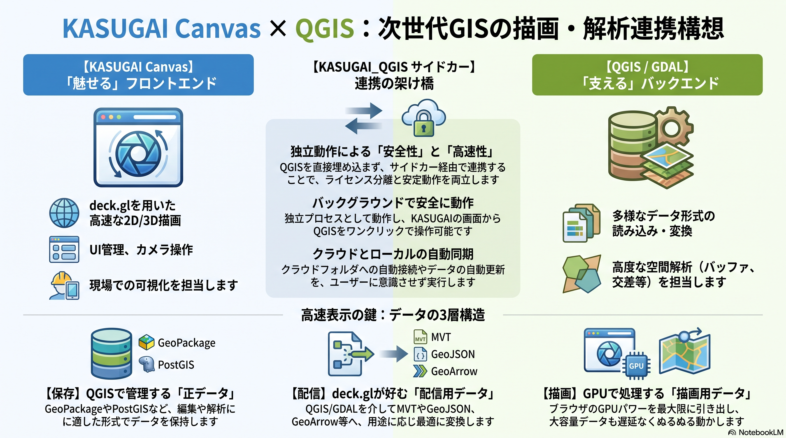

## 5. QGIS・GDAL連携（構想）

本章では、KASUGAI Canvasをメイン画面・最終2D/3D表示エンジンとし、QGIS・GDALを多様なGISデータを扱うための変換・編集・解析基盤として連携する構想をまとめる。

これは現行実装の説明ではなく、現在のGeoJSON・XYZ・DEM・3D Tiles対応を出発点として、QGIS・GDAL対応を段階的に追加するための設計方針である。



## 5.1 基本方針

QGISの画面や`QgsMapCanvas`をKASUGAIへそのまま埋め込むのではない。QGIS・GDALが扱える多様な入力形式を、deck.glが効率よく描画できる形式へ変換・配信する。

```text
各種GISデータ
├─ GeoPackage / Shapefile / FileGDB
├─ PostGIS
├─ GeoTIFF / COG
├─ LAS / LAZ
└─ 3D都市モデル
        ↓
QGIS Processing / PyQGIS / GDAL・OGR
        ↓
KASUGAI向け変換・配信層
        ↓
GeoJSON / MVT / GeoArrow / XYZ / WMTS / 3D Tiles
        ↓
deck.gl + Three.js
        ↓
KASUGAI Canvasで最終表示
```

### 役割分担

| 役割 | 担当 |
|---|---|
| メインUI、レイヤー管理、カメラ、最終表示 | KASUGAI Canvas |
| ベクター、タイル、Terrain、3D TilesのGPU描画 | deck.gl |
| GLB、点群、3DGS等の補助3D描画 | Three.js |
| 多様な形式の読み込み・変換 | GDAL・OGR / QGIS |
| 編集・属性・高度な空間解析 | PyQGIS / QGIS Processing |
| 正データの保存 | GeoPackage / PostGIS / FileGDB等 |

## 5.2 データの3層構造

編集用データと描画用データを同じ形式に統一しない。正データ、配信用データ、描画データを分離する。

```text
正データ
GeoPackage / PostGIS / FileGDB / GeoTIFF
        ↓ 変換・抽出・タイル化
配信用データ
GeoJSON / MVT / GeoArrow / XYZ / WMTS / 3D Tiles
        ↓ 読み込み・デコード
描画データ
TypedArray / binary attributes / deck.gl layer
```

| 層 | 目的 | 主な形式 |
|---|---|---|
| 正データ | 編集、属性、解析、保存 | GeoPackage、PostGIS、FileGDB、GeoTIFF |
| 配信用データ | 範囲・ズーム単位の取得 | GeoJSON、MVT、GeoArrow、XYZ、WMTS、3D Tiles |
| 描画データ | GPUへ効率よく渡す | TypedArray、binary attributes、deck.gl layer |

この分離により、編集に適した形式を維持しながら、表示には高速な別形式を利用できる。

## 5.3 ベクター連携：QGIS・GDALからdeck.glへ

ベクターは、QGIS・GDALを正データへのアクセスと変換の窓口にする。

```text
GeoPackage / FileGDB / PostGIS
        ↓
QGIS Processing / GDAL・OGR
        ↓
┌────────────────────────────────────┐
│ 小規模・編集結果       → GeoJSON    │
│ 大規模・範囲配信       → MVT        │
│ ローカル大容量・高速   → GeoArrow   │
│ 動的検索・属性取得     → JSON API   │
└────────────────────────────────────┘
        ↓
deck.gl
```

### GeoJSON：最初の連携形式

小〜中規模データ、編集直後の確認、属性連携に使用する。現在のKASUGAI Canvasは`GeoJsonLayer`を中心に実装されているため、最初のQGIS連携形式に適している。

```text
QGIS / GDAL
    ↓ GeoJSON
KASUGAI `GeoJsonLayer`
```

### MVT：大規模ベクターの基本形式

広域・大容量データでは、全件をGeoJSONで取得せず、表示範囲とズームに応じてMVTを取得する。

```text
KASUGAIの表示範囲・ズーム
        ↓
MVTタイル取得
        ↓
KASUGAI `MVTLayer`
        ↓
必要に応じてTerrainExtensionでドレープ
```

MVTの生成・配信には、QGIS Server、GDAL・OGR、データベース側のタイル生成、専用のタイル生成処理を利用する。MVTと`MVTLayer`は将来追加する機能として扱う。

### GeoArrow・Arrow・TypedArray：大容量ローカルデータ

ローカルPC上で大容量ベクターを高速に扱う場合は、Arrow系のバイナリ形式へ変換し、Web Workerでデコードしてdeck.glのbinary attributesへ渡す。

```text
QGIS / GDAL
    ↓ Arrow変換
GeoArrow / Arrow
    ↓ Web Worker
TypedArray / binary attributes
    ↓
deck.gl
```

GeoArrowはすべてのデータの標準形式にするのではなく、GeoJSONで十分な小規模データや、MVTが適する範囲配信データとは使い分ける。

## 5.4 ラスタ連携：公開サービスとQGIS管理データ

### 公開XYZ・WMTS

公開されているXYZやWMTSは、QGISとKASUGAIが同じ配信元をそれぞれ直接利用する。

```text
公開XYZ / WMTS
    ├─ QGISで読み込む
    └─ KASUGAIで直接読み込む
```

この場合、QGISがKASUGAIへ再配信する必要はない。

### QGIS管理ラスタ

QGIS Desktopは既存のXYZを読み込めるが、QGISプロジェクト内のGeoTIFF等を自動的にXYZとして配信するわけではない。QGIS管理ラスタをKASUGAIへ渡す場合は、次のいずれかを選択する。

```text
QGIS管理ラスタ
    ├─ QGIS Server → WMS / WMTS
    ├─ 事前タイル化 → XYZ
    ├─ COG / 独自タイル配信
    └─ ローカルファイルをKASUGAIが直接取得
```

WMTSをKASUGAIの`TileLayer`で利用する場合は、TileMatrixSet、座標系、原点、ズーム番号、Y軸方向がXYZ形式と一致するか確認する。一致しない場合は、Rust/Axum等のタイルアダプターでXYZリクエストをWMTSへ変換する。

## 5.5 DEM・3Dデータ：KASUGAIで直接描画

DEMと3D都市モデルは、可能な限りQGISを経由せず、KASUGAIが直接ストリーミングする。

```text
DEM標高タイル
    ↓
KASUGAI `TerrainLayer`

3D Tiles
    ↓
KASUGAI `Tile3DLayer`

QGISベクター
    ↓ GeoJSON / MVT / GeoArrow
KASUGAI `GeoJsonLayer` / `MVTLayer`
    ↓
TerrainExtension
    ↓
DEMまたは3D Tilesの表面へドレープ
```

QGISとKASUGAIが同じ3Dデータソースを参照できればよく、同じ描画処理を共有する必要はない。

- QGIS：参照、属性、管理、解析
- KASUGAI：Terrain、3D Tiles、点群、3DGSの最終描画

高さ基準はデータごとに管理する。標高とWGS84楕円体高が異なるデータを重ねる場合は、QGIS処理層またはKASUGAI側で補正する。

## 5.6 QGIS・GDAL機能層

KASUGAIから呼び出す処理は、GDAL・OGRとQGIS Processingを使い分ける。

```text
KASUGAI Canvas
    ↓ HTTP / IPC
Rust/Axum連携API
    ├─ GDAL・OGR：入出力、形式変換、CRS、タイル化
    └─ PyQGIS / QGIS Processing：編集、属性、高度な空間解析
```

| 処理 | 推奨実装 |
|---|---|
| GeoPackage・GeoTIFFの読み書き | GDAL・OGR |
| Shapefile・FileGDBの変換 | GDAL・OGR / PyQGIS |
| CRS変換 | GDAL・OGR / QGIS |
| GeoJSON・MVTの生成 | GDAL・OGR / QGIS Server / 専用タイル処理 |
| バッファ・交差・クリップ | QGIS Processing |
| 属性検索・編集 | PyQGIS / GDAL・OGR / データベースAPI |
| 3D Tiles・点群生成 | 専用変換処理、必要に応じてQGISと連携 |

想定するAPIは次のとおりである。

```text
POST /api/qgis/layers
POST /api/qgis/features/query
POST /api/qgis/features/edit
POST /api/qgis/processes/run
GET  /api/qgis/processes/{id}
GET  /api/qgis/state
```

## 5.7 選択・編集・再描画

### 選択

```text
KASUGAI picking
    ↓ layerId / featureId
QGIS・GDAL連携API
    ↓ 属性・ジオメトリ取得
KASUGAI属性パネル
```

### 編集

```text
KASUGAI編集UI
    ↓ GeoJSON / JSON Patch
PyQGIS / GDAL・OGR / データベース
    ↓
GeoPackage / PostGIS / FileGDB
```

編集後は、変更されたフィーチャーまたはタイルだけを再取得してKASUGAI側で再描画する。正データを直接deck.gl用形式に置き換えるのではなく、編集結果から配信用データを更新する。

## 5.8 カメラ・CRS・連携状態

カメラの正本はKASUGAI Canvasとする。KASUGAIの表示範囲や選択位置を、必要に応じてQGIS処理層へ通知する。

```text
KASUGAI cameraState
├─ longitude
├─ latitude
├─ zoom
├─ bearing
└─ pitch
        ↓ 必要に応じて
QGIS処理層へ中心座標・範囲を通知
```

`pitch` は Cesium の `camera.pitch` と同じ符号（水平 0°、真上 +90°、真下 −90°）を採用します。

QGISプロジェクトのCRSからKASUGAIの表示用座標系へ変換する。通常のWeb表示ではWGS84経度緯度を基本とし、編集・解析時は元レイヤーのCRSを維持する。

## 5.9 現行実装と構想の境界

現行のKASUGAI Canvasで利用できる主な形式と、今後の構想を分けて管理する。

```text
現行
QGIS相当のデータ → GeoJSON → GeoJsonLayer
DEM               → TerrainLayer
3D Tiles          → Tile3DLayer
XYZ               → TileLayer

構想
QGIS / GDAL
    ├─ 小規模・編集 → GeoJSON → GeoJsonLayer
    ├─ 大規模配信   → MVT → MVTLayer
    └─ 大容量高速   → GeoArrow / Arrow → binary deck.gl
```

MVT、GeoArrow、QGIS Processing、PyQGIS、GDAL連携APIは、現行実装に追加する拡張機能である。

## 5.10 実装ロードマップ

| Phase | 内容 | 成果 |
|---|---|---|
| 1 | GeoJSON連携と属性・選択APIを整理 | QGISデータをKASUGAIで表示・検索 |
| 2 | GDAL・OGRでGeoPackage、FileGDB、GeoTIFFを読み書き | 多様なデータ形式の入出力 |
| 3 | KASUGAI向け変換APIを追加 | 変換処理を画面から実行 |
| 4 | MVT生成と`MVTLayer`を追加 | 大規模ベクターのタイル配信 |
| 5 | QGIS Processing / PyQGISを追加 | バッファ、交差、クリップ等の解析 |
| 6 | GeoArrow / ArrowとWeb Workerを追加 | 大容量ベクターの高速処理 |
| 7 | QGIS管理ラスタのWMTS・事前XYZ・COG配信 | QGISラスタの効率的な共有 |
| 8 | Terrain・3D Tiles・点群とのドレープ連携 | 3D現場確認の統合 |

## 設計上の結論

本構想の基本方針は、次のとおりである。

> **KASUGAI Canvasをメイン画面および最終2D/3D表示エンジンとし、QGIS・GDALを多様なGISデータをdeck.gl向け形式へ変換・配信する基盤として利用する。**

QGISの画面をKASUGAIへそのまま埋め込むのではなく、正データを維持したまま、用途に応じてGeoJSON、MVT、GeoArrow、XYZ、WMTS、3D Tiles等へ変換する。小規模データはGeoJSON、大規模ベクターはMVT、ローカル大容量データはGeoArrowまたはArrowを基本とし、KASUGAIのdeck.glとThree.jsで最終描画する。
